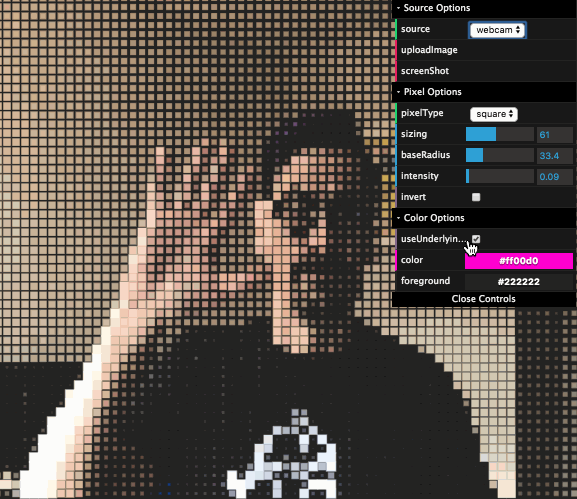

*current experiment with image rasterization with Canvas and JavaScript - this is a work in progress and taken from things learned and read online.*


# Rasterization

  Takes in either a static image or webcam video signal and then processes that information rended on a hidden canvas to produce an average luminosity level which is translated into data points and rendered on a visible canvas.

  You can select the input source in the dat.gui menu as well as export a png file to your downloads from the output.

  The entry point to the application is 
  ```src/index.js``` ---> ```cartridge\RasterApp.js``` which points to our Application js file. 

## Run the example
  Requires Node and Yarn to be installed for build and development.

  *Open a terminal window and type the following for local webpack dev server...*
  ```bash
  $ yarn install
  $ yarn dev
  ```
  open http://localhost:2020
