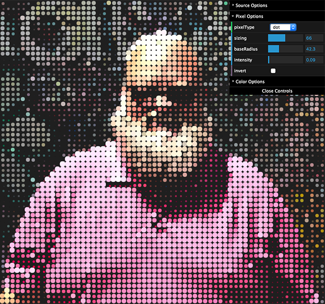

*current experiment to learning image rasterization with Canvas and JavaScript - this is a work in progress and taken from things learned and read online.*


# Rasterization

  Current Mapping --> ```index.js``` --> (render file) ```WebacmZing.js``` (or just about any other file in src)

## Run the example
  Requires Node and Yarn to be installed for build and development.

  *Open a terminal window and type the following for local webpack dev server...*
  ```bash
  $ yarn install
  $ yarn dev
  ```
  open http://localhost:2020
